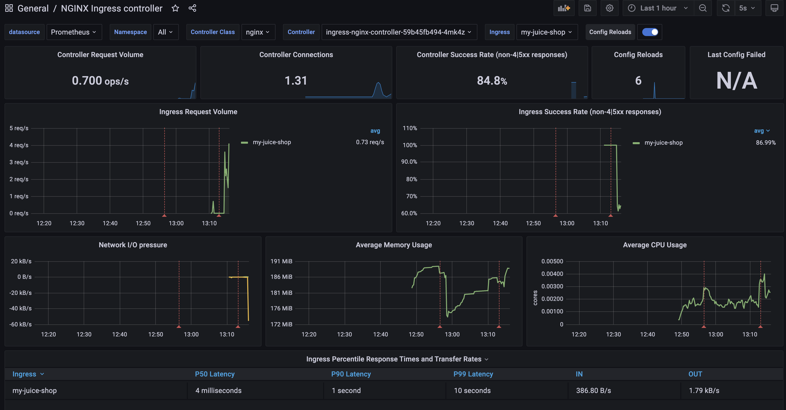

# My juice shop

## Environment

- MacOS v11.4
- Minikube v1.22.0

## Deployment

### Start minikube

Issues
- https://github.com/kubernetes/minikube/issues/7332
- https://github.com/kubernetes/minikube/issues/6296

```sh
minikube start --vm=true --hyperkit-vpnkit-sock=auto --nodes 2 --addons ingress  
```

### Enable ingress-nginx metrics

[Official documentation](https://kubernetes.github.io/ingress-nginx/user-guide/monitoring/) does not provide a way to enable metrics on minikube, so I'm simply annotating pods

```sh
kubectl annotate pods --selector=app.kubernetes.io/component=controller -n ingress-nginx prometheus\.io/scrape="true" prometheus\.io/port="10254"
```

### Deploy Prometheus and Grafana

```sh
kubectl apply --kustomize github.com/kubernetes/ingress-nginx/deploy/prometheus/
kubectl apply --kustomize github.com/kubernetes/ingress-nginx/deploy/grafana/
```

### Deploy my-juice-shop

```sh
kubectl create namespace my-juice-shop
kubectl apply -f ./my-juice-shop.yaml -n  my-juice-shop
```

## Dashboard setup

To setup Grafasna dashboard, please follow [official guide](https://kubernetes.github.io/ingress-nginx/user-guide/monitoring/#grafana). 




## Usage

Add my-juice-shop.local record with minikube ip to your hosts file

```sh
sudo echo "$(minikube ip)  my-juice-shop.local" /etc/hosts
```

You can access my juice shop on http://my-juice-shop.local or https://my-juice-shop.local

> **Note**  
> Certificate will not be valid

Scan for OWASP vulnerabilities

```sh
docker run -t owasp/zap2docker-stable zap-full-scan.py -t http://my-juice-shop.local
```

